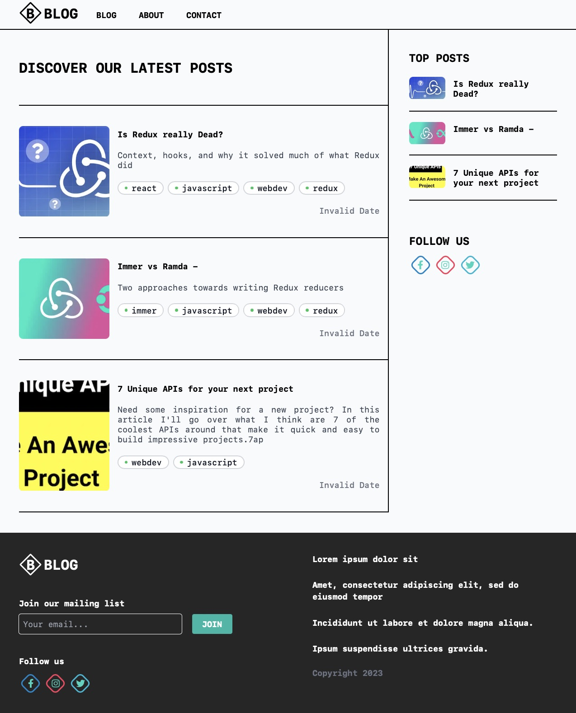

# BBlog - best development posts

## General info

First project created from my own photoshop template using React and Next.js.
The aim of the project was to remember and stabilize the information from the
online course.

## Technologies

- ReactJS 18.2
- Next.js 13.3
- Tailwind CSS 3.3
- TypeScript 5.0

## Website

[https://blog-nextjs-ten-wheat.vercel.app](https://blog-nextjs-ten-wheat.vercel.app)

## Illustrations

